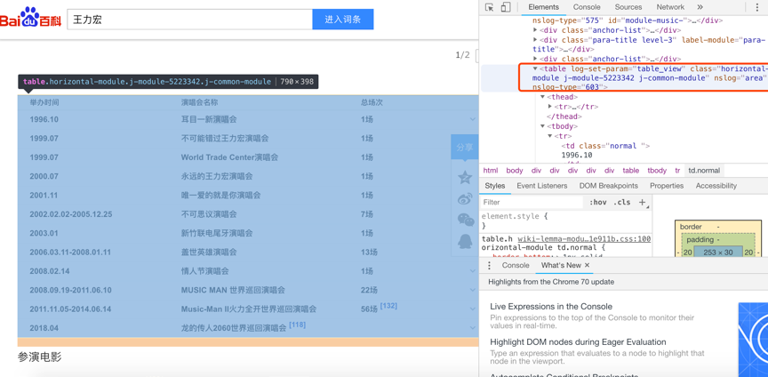
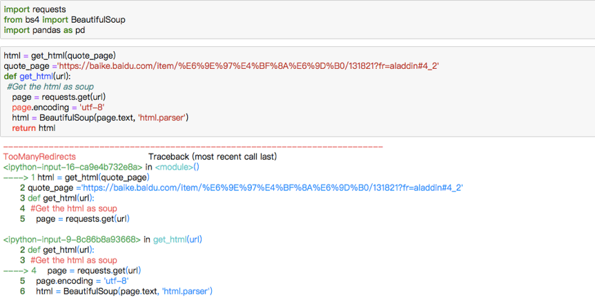
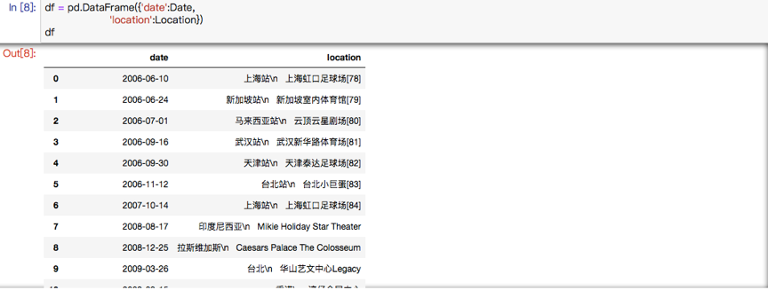
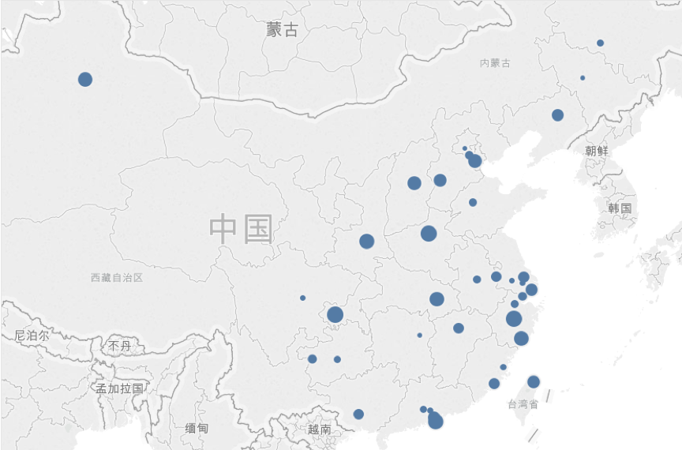
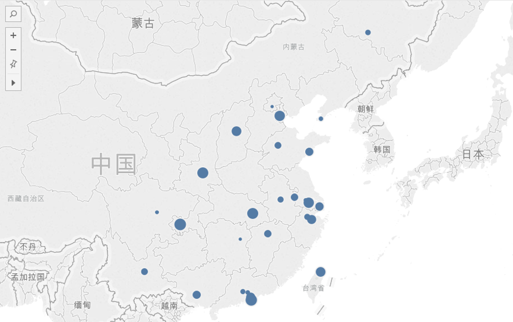
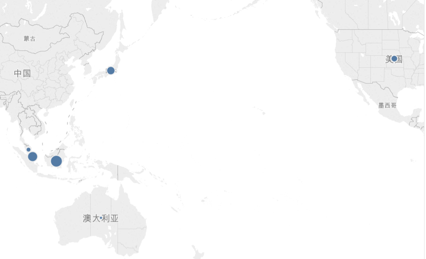
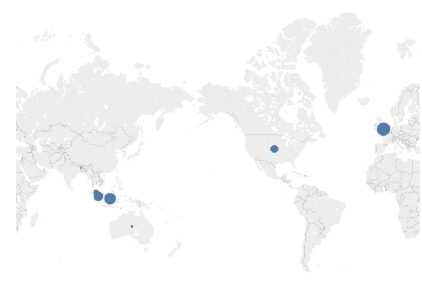

# We crawled through more than 10 years of Concert Info from two music stars and discovered these secrets

# 1 Introduction
Due to the technology development, music industry has kept changing. In the past, record was the main form and source of revenue. But as the electronic player developed, people tend to listen to music through the pod and mobile phone, album circulation keeps going down. And at the same time, the number of vocal concerts shows an increasing trend, mainly because the public need of hearing high tone quality songs and the improvement of living standard.Therefore, we decided to choose the music industry as our main topic and try to showcase the changes in the music industry by analyzing two representative singers’ vocal concerts. At first, we wanted to capture the album sales of the two singers.However, it is found that the album sales statistics are not authoritative and representative, and many singers' album sales are spontaneously summarized by fans. Secondly, the data on many authoritative websites are only about five years old, and they are not very representative.Therefore, we finally choose the vocal concert as the research direction of the singer comparative analysis.

For Post-90s generation, large number of them are listening to the songs of Taiwan singers like Jay Chou, Leehom Wang and JJ Lin when they grow up. Jay Chou is recognized as tThe King of Chinese Singers, his concert number, frequency, location is far more than other Chinese male singers, therefore can not use him as a representative to carry on the analysis.So after deep consideration, we decide to focus on Leehom Wang and JJ Lin.

When you search the two singers on the Internet, you may surprisingly find that they have a lot of similarities. Firstly, none of them were born in Taiwan, but they began their careers at Taiwan. Secondly, They all studied music in a systematic way and graduated from a professional music school. Thirdly, they have been well-known by the public around 20004, which they have published a popular song respectively. In addition, the two also participated in the filming of movies, TV series and variety shows.

Therefore, we choose the two Chinese singers-Leehom Wang and JJ Lin with a high degree of similarity to carry out the analysis.Due to the difficulties of finding the record sales, we consider put the vocal concerts at first, the record sales as supplement.By capturing the information about the number and location of the two people's vocal concerts on Baidu Encyclopedia, this paper analyzes the similarities and differences between the two in choosing the venue of the concert from the horizontal-time dimension, and from the longitudinal-location dimension, analyze the similarities and differences between the two in choosing the city where the vocal concert has been held.
# 2 Correlative research
After searching on the Internet and related literatures, we find these three cases are highly related to our research topic.
The first is Zhang Huimei and Wong Fei album sales and concert data comparison. The first is the comparison of record sales, the second is the comparison of various Chinese lists, and the comparison of sales lists in Malaysia, Japan, and other Asian countries, and finally, the comparison of the number of concerts between the two. And emphasized the Taipei small Dome history single round circuit highest box office this contrast factor, finally obtains Wang Fei in the record sales, the list rank, the concert quantity is higher than Zhang Huimei. In this study, first of all, the data selection is not authoritative, all of them come from the data summarized by fans in Tieba, and they are not authoritative. Secondly, the analysis is only a list of data, not a scientific analysis, is not representative.
The second is to crawl the Billboard(Proof of a musician's achievements in his field of expertise) data, found the music world "star-making law." What kind of singer is the most popular in the market in the eyes of music production companies, and the most profitable for the company? What factors affect the performances of these artists?The study used data analysis to find a potential music star under Billboard. The researchers measured the number of singers on the list and analysis of the frequency of different musical style, finding that if companies considered short-term earnings, They can sign up with artists who are among the most popular types of music of the recent past. But if you want to pursue long-term profits, those who are creative and can create their own style of things is a better choice.This study is based on analysis of the frequency of different musical style, is not representative and does not have a comparative factor. But this study takes a more scientific and rigorous method, and by drawing the icon more intuitive show the results of the study.

The third case is that Jay Chou, Leehom Wang and JJ Lin are singers at the same level? The case simply makes a table listing the albums and songs of some of the hottest singers from 2000 to 2010.Analysis shows that JJ Lin, the first musician in 2003, and the song named Jiangnan  in 2004 is the only song that can compete with song named Qilixiang / my territory(Jay Chou). It is also from this song that the heat of the popularity of JJ Lin has risen very fast. In 2005, the songs named number89757, a thousand years later in 2006, turned out that had achieved great success. In 2007, the song named response from the West was not good enough, but JJ Lin in 2008 became popular again, the songs named no tide and no money, small dimples and looking forward to love have added a lot of points. After that, JJ Lin's songs were still at a high level. Leehom Wang’s song named the sun and moon in heart was good in 2004. From the song named Huatiancuo, Gaishiyingxion, Dachengxiaoai and Kiss Goodbye in 2005 , Leehom Wang maintains a high degree of heat but the speed of publishing songs become much slower. And he spent most of his time not 
writing songs, but acting in movies
In a word, these studies provide us with ideas and methods to study Leehoom Wang and JJ Lin. It may be difficult to compare who is better from the vocal concert point of view, but we can analyze the two singers from the differences in their concerts. Therefore, our research questions are as follows：
The geographical distribution of vocal concerts is different between the 2 singers ?
Is the change of vocal concert venue of the two singers consistent in terms of time?

# 3 Data collection
In order to contain the exact and exhaustive vocal concert information of JJ LIN and Leehom Wang, it is preferable to choose a website that is not only authoritative but also involves a wide range of topics. Firstly, we chosen Wikipedia as our platform, unfortunately, the table part of our targeting area was not structured for us to scrape.

As it can be seen in the figure 1, the country corresponds to multiple time variables. It may be a problem when we collecting the data sources. 
On Baidu Baike website, we chose to compare JJ Lin and Wang Leehom's concerts as part of our survey. We choose to capture the content of the concert information area, in addition to the concert information, but also the time, the name of the concert, the location and the venue.
So, we turned to the Baidu site, the analogue, for the help. Surprisely, Baidu has more neat structure and complete information for us to scrape. 

Additionally, Baidu provides the total series name of the vocal concerts (figure2). So, after weighing the pros and cons, we ultimately decided to crawl data on baidu.com.
After deciding which platform to use, we go to Baidu Baike.com for analysis. To get the keywords for two stars concerts, we first need to know the specific url of each detailed page. Through comparison, we find that in the following two links：https://baike.baidu.com/item/%E6%9E%97%E4%BF%8A%E6%9D%B0/131821 and https://baike.baidu.com/item/%E7%8E%8B%E5%8A%9B%E5%AE%8F, it is impossible to clearly distinguish the two differences. So, we're focusing on the concert area.

In examining the concert blocks we want to capture, we find that the parameters of the blocks identifying the concert are: body > div.body-wrapper.feature.feature_small.starSmall > div.content-wrapper > div > div.main-content > div > table.horizontal-module.j-module-5223342. where the difference in the value of "j-module-5223342" is the major identification of the two stars' Concert Information. So as long as we crawl for this information, we know that we can crawl for every star details page.

# 4 Data processing
Obviously, the website we choosing use the HTML language to build the website. Therefore, we use BeautifulSoup to crawl the specific data on Baidu.com. And we also import request try to get the access to the website. But unfortunately, due to the anti-reptile technology, we cannot access to the website. 

But we did not think about giving up, and we search the tutorial for getting the permit to the Baidu. Hard work pays off, we finally success to access the website. 

Firstly, we define a function to get the url as soup, where the session object of the requests library can also give us the default data for the request method, by setting the properties of the session object. At the same time, we consider that Baidu does not like to be accessed by crawlers, so it will detect the connection object. If it is crawler, that is, non-human Click access, it will not allow you continue to access, so, in order to prevent its anti-crawler program, the User Agent is stored in the Headers, and the server can judge who is accessing by looking at the User Agent in the Headers to achieve the effect of "stealth."

After successfully access to the website, we find that all we need is a table containing the specific information. Specifically, the summary concert information we scraping are the “normal” class under the label <td>, and the specific concert information, including time and location, are “column” class under the label . After finding these characteristics, we set a card to contain the information and use “get” function to scrape the variables. Also, we use “for…in…” function to loop every variable.

Here, we want to get detailed information about all of the concerts under submodule: when, where, and how many. So here we learn to use a function to combine a traversable data object (such as a list, tuple, or string) into an index sequence, listing both data and data subscripts.
The enumerate function states:
Function prototype: enumerate (sequence, [ Start 0])
Function: The cyclable sequence sequence lists sequence data and data subscripts starting with start.
That is, for a traversable data object (such as a list, tuple, or string) , enumerable combines the data object into an index sequence, listing both data and data subscripts.

However, the variables we tend to survey are under the same label, so we necessarily need to split them into different parts, which will be convenient and effective for the further analysis. To achieve the goal, we add “,” to separate two variables in the former step, next, we still use “for…in…” loop to traverse each item. Before appending them into new name, we use “print” to figure out which number represent the date or the location. In this case, we are easily to decide which one to append. It is operably for split the variables efficiently and effectively.

After scraping all the data we want, we use Pandas to create our own table to present our results. We endow the previously “information” Date to the title of the table’s title.

Finally, we get totally 97 information of JJ LIN and 105 information of Leehom WANG. In order to analysis them conveniently we write the data into csv files using “utf-8”, after cleaning the data.

These are all the processes we using to scrape the vocal concert between JJ LIN and Leehom WANG.  

# 5 Discussion & Implication
The data we have drawn from the websites can be summarized in several genres: the regions, the dates and the sessions. Moreover, we also can probe these three dimensions from two main aspects: the distribution preference and the changes though ages.

## 5.1 Distribution Preference

First of all, through the data, we can find that Taibei is most preferred location both for Leehom Wang and JJ Lin, follows by Shanghai and Beijing. In general, their preferences both have a positive correlation with the certain city’s political influence (the capital city of a region is more likely to be chosen), economical ability (first-tier cities like Shanghai is also hot place to be chosen) and culture (the majority of cities they chose is the place people are Chinese native speakers, even foreign cities like San Francisco, Las Vegas are the place that there are many ethnic Chinese inhabit).

However, it is obvious that the concert distribution of Leehom Wang has more diversity than JJ Lin. First we can see from the number of cities they went to, Leehom Wang has went to 53 cities, and JJ Lin has went to 28 cities. Although the total sessions of their concert are almost the same. 

Secondly, we can analyze the differences of their distribution preference from the geographical perceptions:

From figure 13 and figure 14, we can easily see that Leehom Wang went to more provinces than JJ Lin. Moreover, JJ Lin was mainly focus on south-east area, but Leehom Wang has gone to the provinces like Heilongjiang, Jilin, Liaoning, Xinjiang, where are the provinces with relatively low level of economic development but still have many fans.

On the other hand, though these two figures, it is obvious that south-east area is the region these two singers liked most. Generally speaking, the south held more concerts than the north, and the east held more concerts than the west. And this distribution preference can perfectly match the economic situation of these cities ---- the higher level of a certain region’s economic development, the more sessions of concerts held there.

Speaking to cities in Greater China, both of them like bigger cities than smaller ones; Speaking to cities from overseas, they prefer Asia the most. JJ Lin is come from Malaysia, it is not strange that he chose this place, but Leehom Wang prefer there, too. On the other hand, Leehom Wang graduated from America, compare to JJ Lin, he went to America more often. Therefore, we think hometown is one influence factor of location chosen, but not the decisive factor. What’s more, the reason Leehom Wang went to Malaysia so many times maybe cause by the competition among these two singers, since they have too much things in common (the music style, the high education background, the activities in entertainment circle, for example, they both acted in some films and TV series), their fans certainly have some characteristics or personalities in common. It is possible to make JJ Lin’s fans turn to Leehom Wang, and vice versa.

Different from the distribution in Greater China, JJ Lin’s distribution has more diversity than Leehom Wang. Europe is the place that JJ Lin has held concerts but Leehom Wang has not. This is relatively strange, because Leehom Wang graduated in America, his English ability and western culture understanding is better than JJ Lin.

Another difference from the Greater China distribution is the reason they chose which abroad city is mainly focus on the number of Chinese native speakers. But in Greater China, the economy is the most important reason.

## 5.2 Changes among Years

From figure 17 and figure 18, we can see two common features of these two singers. The first is their concert arrangement both have the tendency from less to more. In 2006, they only held concerts in three regions, but in 2010, the number of points on the map increased a lot. And when it went to 2018, it is almost tenfold of the number in 2006. But the increase speed is becoming low and low.

Due to increased sessions, singers started to explore new area, therefore, both of them started to went to smaller cities, especially Leehom Wang, he has gone to many third-tier cities even forth-tier cities, which is a good thing for the fans in the certain area.

Secondly, the increase of sessions is not consistent, both of them had some ‘gap’ years. Their concert sessions are always from less to more, then less to zero, then to more again. What is interesting is the timing of these two singers’ concert peak was usually very near. It seems they do not worry about the influence of other’s concerts each other.

## 5.3 Implication
We think we have three limitations. The first one is the dimensions are not enough, we have not consider the confounders like the launch timing of album, the political issues among Mainland and Taiwan. Which may cause the inaccurate analysis of our project.

Secondly, due to the difficulty of harvest the whole data, we only analyze the concert data from Baidu, which is a popular but loosely platform, because anyone have the chance to edit the content.

Last but not least, considering to show the data more directly and attractively, we analyzed the data mainly focus on the distribution of different area, ignored to summarize the accurate information and number, which makes our discussion not much persuasive.
  

Reference

1 https://zhuanlan.zhihu.com/p/36860171
2 https://zhuanlan.zhihu.com/p/39255114
3 https://www.zhihu.com/question/22056261

8
8
8
8
8
8
8
8
8
8
8
8
8
8
8
8
8
8
8
8
8
8
8
8
8
8
8
8
8
8
8
8
8
8
8
8
8
8
8
8
8
8
8
8
8
8
8
8
8
8
8
8
8
8
8
8
8
8
8
8
8
8
8
8
8
8
8
8
8
8
8
8
8
8
8
8
8
8
8
8
8
8
8
8
8
8
8
8
8
8
8
8
8
8
8
8
8
8
8
8
8
8
8
8
8
8
8
8
8
8
8
8
8
8
8
8
8
8
8
8
8
8
8
8
8
8
8
8
8
8
8
8
8
8
8
8
8
8
8
8
8
8
8
8
8
8
8
8
8
8
8
8
8
8
8
8
8
8
8
8
8
8
8
8
8
8
8
8
8
8
8
8
8
8
8
8
8
8
8
8
8
8
8
8
8
8
8
8
8
8
8
8
8
8
8
8
8
8
8
8
8
8
8
8
8
8
8
8
8
8
8
8
8
8
8
8
8
8
8
8
8
8
8
8
8
8
8
8
8
8
8
8
8
8
8
8
8
8
8
8
8
8
8
8
8
8
8
8
8
8
8
8
8
8
8
8
8
8
8
8
8
8
8
8
8
8
8
8
8
8
8
8
8
8
8
8
8
8
8
8
8
8
8
8
8
8
8
8
8
8
8
8
8
8
8
8
8
8
8
8
8
8
8
8
8
8
8
8
8
8
8
8
8
8
8
8
8
8
8
8
8
8
8
8
8
8
8
8
8
8
8
8
8
8
8
8
8
8
8
8
8
8
8
8
8
8
8
8
8
8
8
8
8
8
8
8
8
8
8
8
8
8
8
8
8
8
8
8
8
8
8
8
8
8
8
8
8
8
8
8
8
8
8
8
8
8
8
8
8
8
8
8
8
8
8
8
8
8
8
8
8
8
8
8
8
8
8
8
8
8
8
8
8
8
8
8
8
8
8
8
8
8
8
8
8
8
8
8
8
8
8
8
8
8
8
8
8
8
8
8
8
8
8
8
8
8
8
8
8
8
8
8
8
8
8
8
8
8
8
8
8
8
8
8
8
8
8
8
8
8
8
8
8
8
8
8
8
8
8
8
8
8
8
8
8
8
8
8
8
8
8
8
8
8
8
8
8
8
8
8
8
8
8
8
8
8
8
8
8
8
8
8
8
8
8
8
8
8
8
8
8
8
8
8
8
8
8
8
8
8
8
8
8
8
8
8
8
8
8
8
8
8
8
8
8
8
8
8
8
8
8
8
8
8
8
8
8
8
8
8
8
8
8
8
8
8
8
8
8
8
8
8
8
8
8
8
8
8
8
8
8
8
8
8
8
8
8
8
8
8
8
8
8
8
8
8
8
8
8
8
8
8
8
8
8
8
8
8
8
8
8
8
8
8
8
8
8
8
8
8
8
8
8
8
8
8
8
8
8
8
8
8
8
8
8
8
8
8
8
8
8
8
8
8
8
8
8
8
8
8
8
8
8
8
8
8
8
8
8
8
8
8
8
8
8
8
8
8
8
8
8
8
8
8
8
8
8
8
8
8
8
8
8
8
8
8
8
8
8
8
8
8
8
8
8
8
8
8
8
8
8
8
8
8
8
8
8
8
8
8
8
8
8
8
8
8
8
8
8
8
8
8
8
8
8